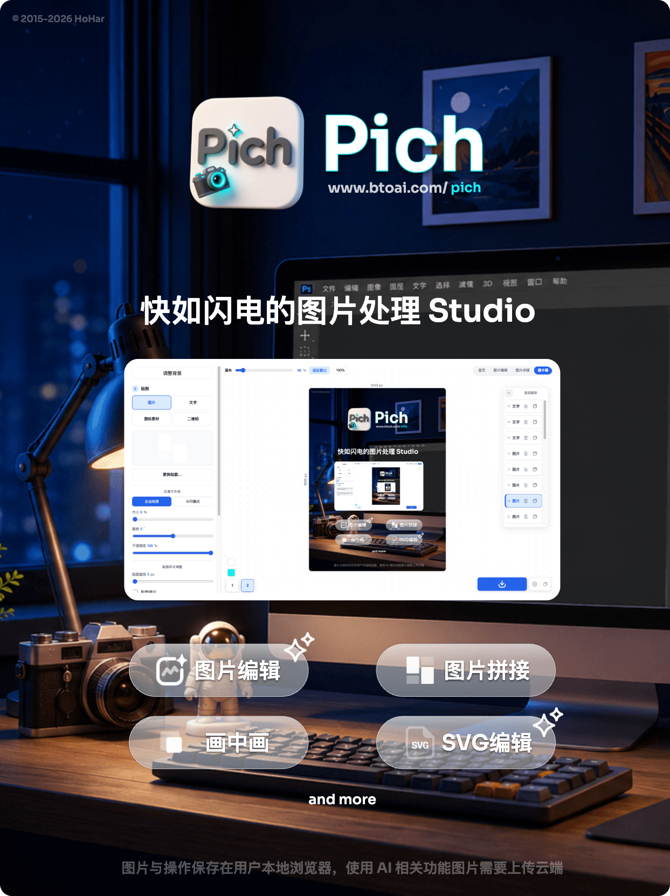
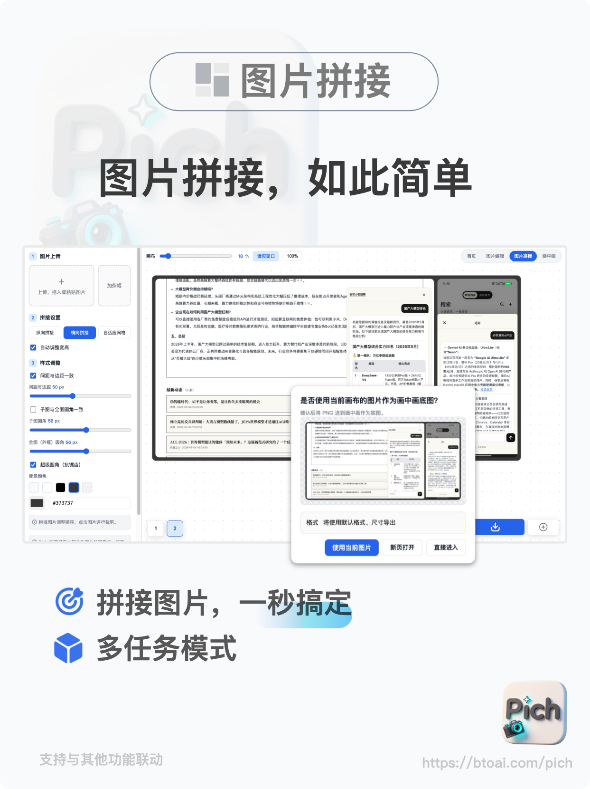
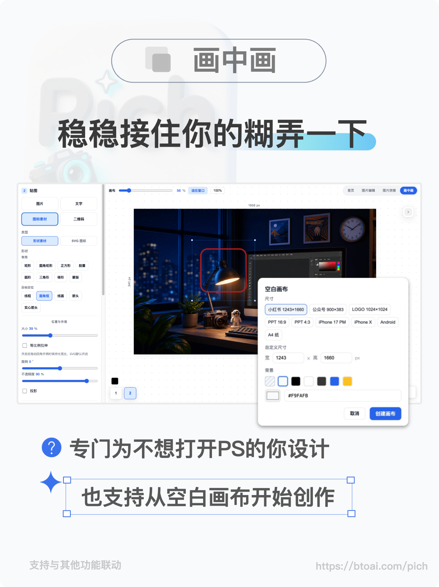
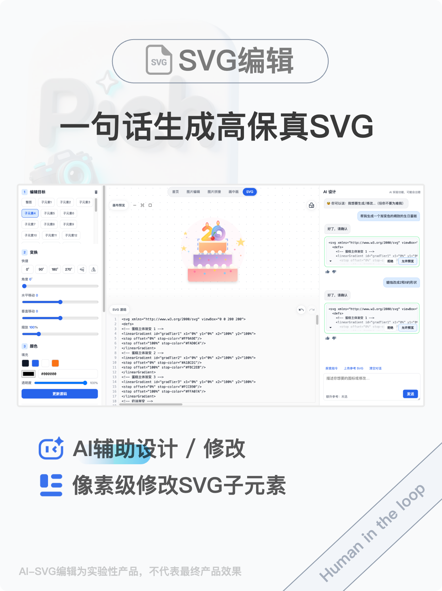

# Pich

**快如闪电的图片处理 Studio** · 稳稳地接住你的「随便糊弄一下」

---

**Pich** 是一套在线图片工具集：抠图、拼接、贴图合成、SVG 编辑、AI 排版，打开浏览器就能用。

> 本仓库为项目展示。

| 工具 | 链接 |
|------|------|
| 图片编辑 Edit | [btoai.com/pich/edit](https://btoai.com/pich/edit) |
| 图片拼接 Stitch | [btoai.com/pich/stitch](https://btoai.com/pich/stitch) |
| 画中画 Process | [btoai.com/pich/pip](https://btoai.com/pich/pip) |
| SVG 编辑 SVGEDIT | [btoai.com/pich/icon](https://btoai.com/pich/icon) |
| AI 排版 AI Studio | [btoai.com/pich/aistudio/](https://btoai.com/pich/aistudio/) |

---

### 图片编辑 · Edit

抠图 · 裁剪 · 圆角 · 描边 · 相框 · 压缩 · 多格式导出

---

### 图片拼接 · Stitch

横/纵/网格拼接，间距、圆角、背景色可调；可与画中画联动

---

### 画中画 · Process

底图 + 贴图（图片、文字、图标、形状、二维码、水印），支持空白画布与常用尺寸预设

---

### SVG 编辑 · SVGEDIT

一句话生成 SVG，像素级编辑子元素；Human in the loop（实验功能）

---

### AI 排版 · AI Studio

自然语言驱动排版，JSON 指令实时应用到画布；支持 AI 生图、抠图与常用画布预设（实验功能）。

---

**隐私**：图片主要在本地浏览器处理，刷新后清空，请及时导出。抠图 / 压缩 / AI 功能需上传云端。

 

[立即体验 →](https://btoai.com/pich/)

© 2015–2026 HoHar · 源码暂未开源

